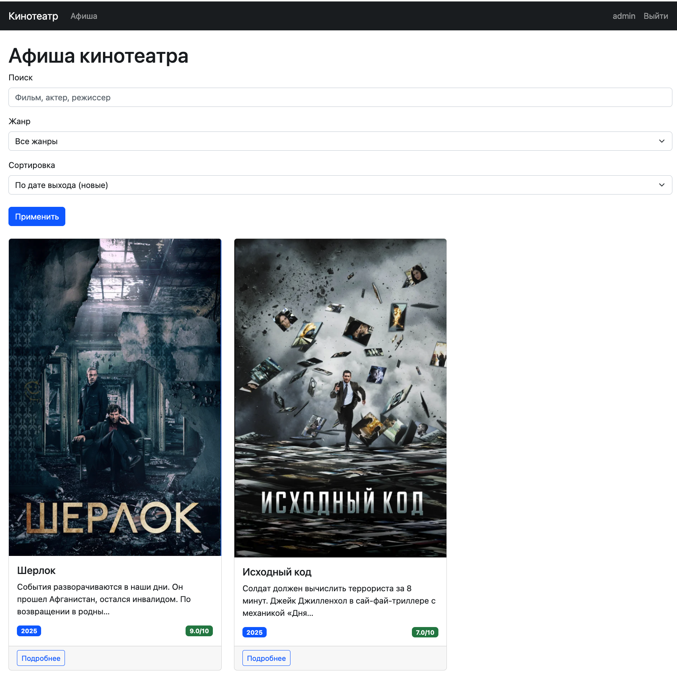
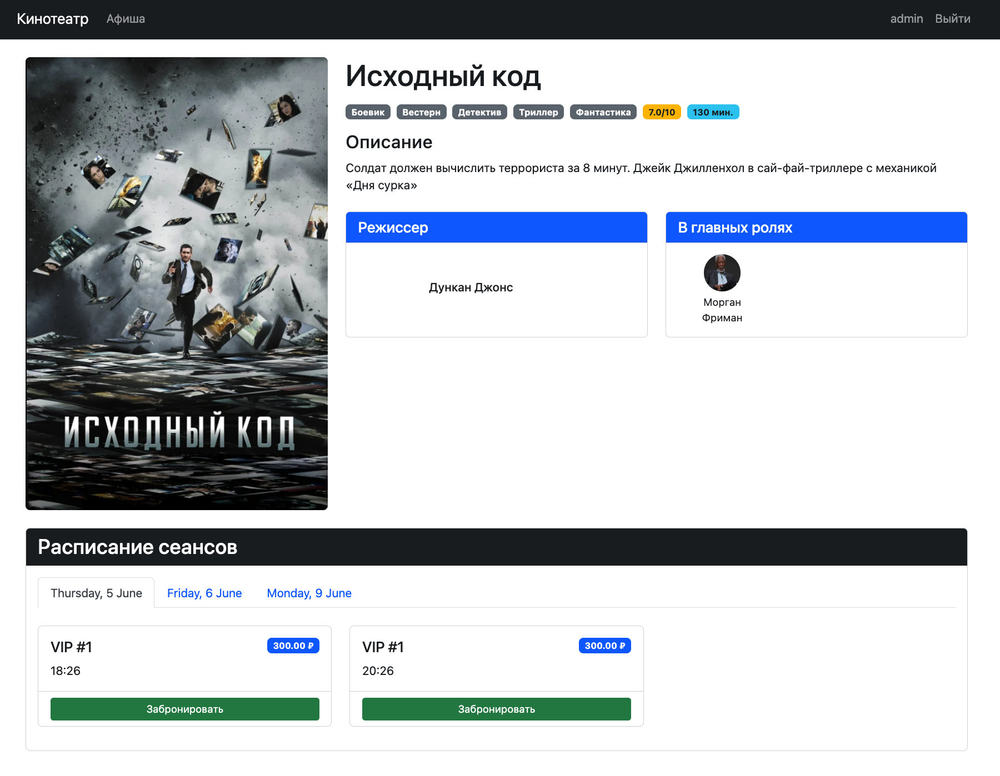
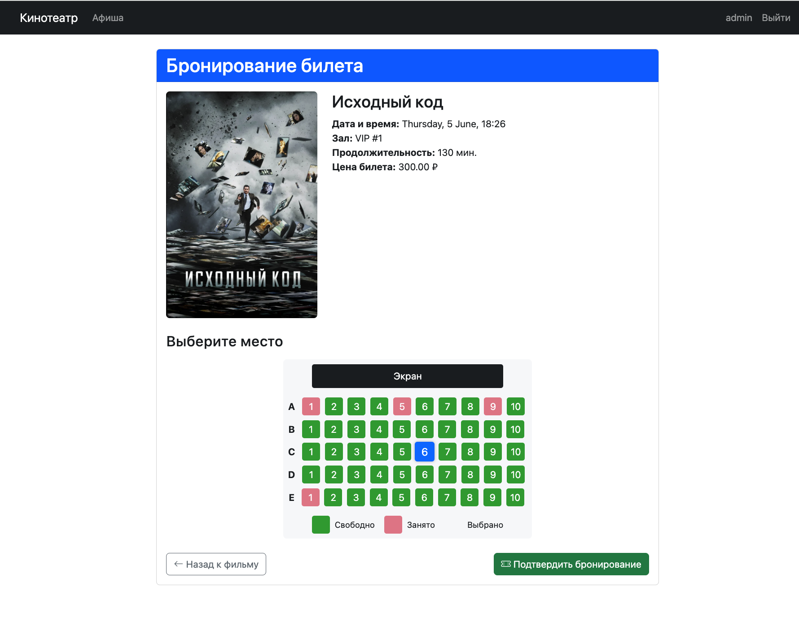
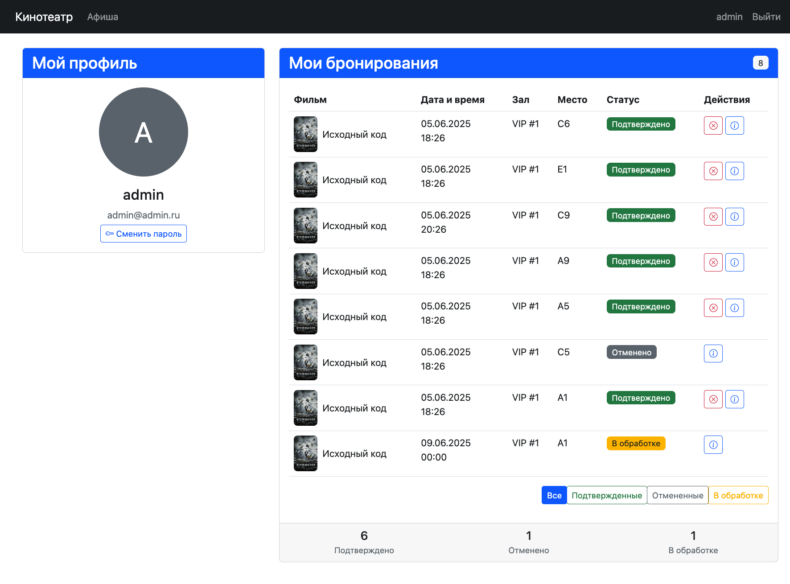
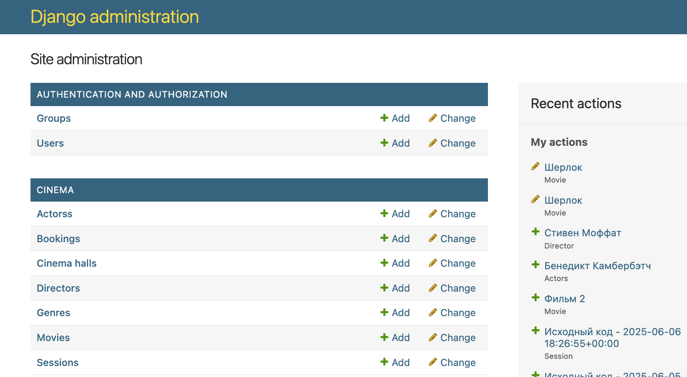

# Cinema Ticket Booking System


Система бронирования билетов в кинотеатр на Django с полным набором функций для администраторов и пользователей.

## Оглавление

- [Основные возможности](#основные-возможности)
- [Технологический стек](#технологический-стек)
- [Установка и запуск](#установка-и-запуск)
- [Скриншоты системы](#скриншоты-системы)
- [Структура проекта](#структура-проекта)

## Основные возможности

### Для пользователей
- 📽 Просмотр афиши с фильтрацией по жанрам и датам
- 🔍 Поиск фильмов по названию, актерам и режиссерам
- 🎟 Онлайн-бронирование билетов с выбором мест
- 📱 Личный кабинет с историей бронирований

### Для администраторов
- 🎬 Полное управление фильмами, сеансами и залами
- 📊 Статистика посещаемости и продаж
- 👥 Управление пользователями
- 📅 Календарь сеансов
- 📦 Добавление сеансов

## Технологический стек

### Backend
- **Django 4.2** - основной фреймворк
- **Pillow** - обработка изображений

### Frontend
- **Bootstrap 5** - адаптивный дизайн
- **JavaScript (ES6+)** - интерактивные элементы
- **jQuery** - AJAX-запросы

### База данных
- **SQLite** - для разработки
- **PostgreSQL** - для production

## Установка и запуск

### Требования
- Python 3.9+

### 1. Клонирование репозитория
```bash
git clone https://github.com/snowdenru/cinema-booking-system.git
cd cinema-booking-system
```

### 2. Настройка виртуального окружения
```bash
python -m venv venv
source venv/bin/activate  # Linux/Mac
venv\Scripts\activate     # Windows
```

### 3. Установка зависимостей
```bash
pip install -r requirements.txt
```

### 4. Настройка переменных окружения
Создайте файл `.env` в корне проекта:
```ini
SECRET_KEY=your-secret-key-here
DEBUG=True
ALLOWED_HOSTS=localhost,127.0.0.1
DATABASE_URL=sqlite:///db.sqlite3
EMAIL_BACKEND=django.core.mail.backends.console.EmailBackend
```

### 5. Применение миграций
```bash
python manage.py migrate
```

### 6. Создание суперпользователя
```bash
python manage.py createsuperuser
```

### 7. Запуск сервера разработки
```bash
python manage.py runserver
```

## Скриншоты системы

### Главная страница
  
*Описание: Главная страница с афишей фильмов, возможностью поиска и фильтрации*

### Страница фильма
  
*Описание: Детальная информация о фильме с расписанием сеансов*

### Бронирование билетов
  
*Описание: Страница выбора места в зале для бронирования*

### Личный кабинет
  
*Описание: История бронирований пользователя с возможностью отмены*

### Админ-панель
  
*Описание: Интерфейс администратора для управления контентом*

## Структура проекта

```
cinema-booking-system/
├── cinema/                      # Основное приложение
│   ├── migrations/              # Миграции базы данных
│   ├── static/                  # Статические файлы
│   ├── templates/               # HTML шаблоны
│   ├── admin.py                 # Настройки админки
│   ├── apps.py                  # Конфигурация приложения
│   ├── forms.py                 # Формы
│   ├── models.py                # Модели данных
│   ├── tests.py                 # Тесты
│   ├── urls.py                  # URL-маршруты
│   ├── utils.py                 # Вспомогательные функции
│   └── views.py                 # Представления
├── media/                       # Загружаемые файлы
├── screenshots/                 # Скриншоты системы
├── cinema_project/              # Настройки проекта
│   ├── settings/                # Раздельные настройки
│   │   ├── base.py              # Основные настройки
│   │   ├── development.py       # Для разработки
│   │   └── production.py        # Для production
│   ├── urls.py                  # Главные URL-маршруты
│   └── wsgi.py                  # WSGI конфигурация
├── .env.example                 # Пример файла окружения
├── manage.py                    # Управляющий скрипт
└── requirements.txt             # Зависимости
```
  
## Лицензия

Этот проект является учебным и распространяется под лицензией MIT. См. файл [LICENSE](LICENSE) для получения дополнительной информации.

---
**Cinema Ticket Booking System** © 2025
